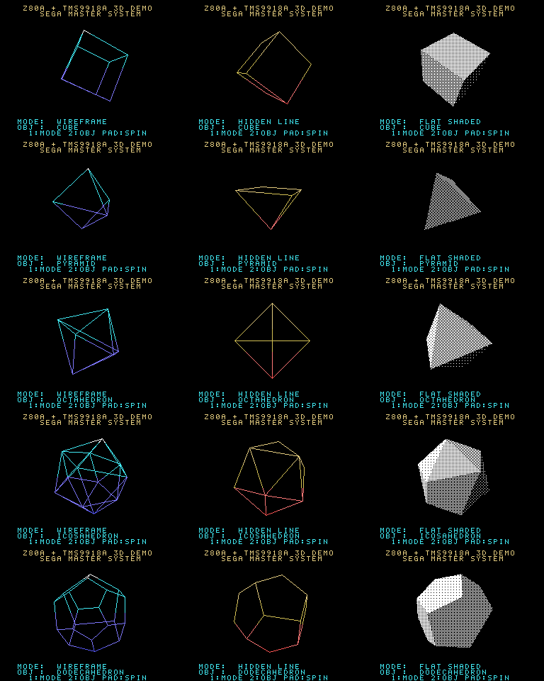

# Z80 3D DEMO — Z80A + TMS9918A (SEGA Master System)

Z80A CPU と TMS9918A 互換 VDP (Graphics II / Mode 2, 256×192 1bpp ビットマップ) だけで
リアルタイム 3D を描くシンプルなデモです。セガ・マスターシステム (SMS / マークIII) の
ROM カートリッジイメージ (32KB) としてビルドされます。



## 機能

| 項目 | 内容 |
|---|---|
| 描画モード | ワイヤーフレーム / 陰線消去 (バックフェースカリング) / フラットシェーディング (ポリゴン塗り) |
| オブジェクト | CUBE, PYRAMID, OCTAHEDRON, ICOSAHEDRON, DODECAHEDRON |
| 回転 | X/Y/Z 3 軸回転 + 透視投影 |
| シェーディング | 面法線・光源の内積 → 4×4 Bayer ディザ 17 段階 |
| 表示 | 128×128 ドットのビューポート、ダブルバッファ (ティアリングなし) |

### 操作 (パッド 1)

| ボタン | 動作 |
|---|---|
| 1 | 描画モード切替 |
| 2 | オブジェクト切替 |
| ↑ / ↓ | X 軸回転速度 -/+ |
| ← / → | Y 軸回転速度 -/+ |

無操作のまま約 160 フレーム (描画フレーム) 経過すると、モード → オブジェクトの順で自動的に切り替わります。

## ビルド

必要なのは **Python 3 のみ** です (外部アセンブラ不要)。

```sh
make            # -> build/z80_3d_demo.sms
make test       # 同梱のテスト用エミュレータで 1500 フレーム実行し build/shots/ に PNG を保存
```

ビルド済み ROM: [`dist/z80_3d_demo.sms`](dist/z80_3d_demo.sms)

Emulicious / MEKA / Kega Fusion などの SMS エミュレータ、または実機用フラッシュカートで実行できます
(ヘッダのチェックサムは書き込み済みなので、海外版 SMS の BIOS チェックも通る想定です)。

### 自作モデル (OBJ) の追加

`models/` に Wavefront OBJ を置いて `make` するだけで、オブジェクトとして追加されます
(ボタン 2 で切替)。FBX などは Blender で OBJ に書き出してください。

- 変換内容: 中心合わせ・半径 54 に正規化・8bit 化、同一頂点の結合、縮退面の除去、
  凹多角形の三角形分割、面法線の計算 (`tools/obj2inc.py`)
- 制限: 頂点 128 / 辺 255 / 面 255 まで。目安は 30〜80 ポリゴン
- Z ソートは無いため、凹んだ形状は陰線消去・シェーディングで正しく重ならない (ワイヤーは常に正しい)

### 構成

```
src/main.asm           デモ本体 (Z80 アセンブリ)
src/gen_*.inc          tools/gen_tables.py が生成するテーブル・3D モデル・フォント
tools/z80asm.py        小型 2 パス Z80 アセンブラ (sjasmplus 風の文法)
tools/smsheader.py     SEGA ヘッダ ("TMR SEGA") のチェックサム書き込み
tools/smsemu.py        検証用ヘッドレス SMS エミュレータ (Z80 + VDP Mode 2 + PNG 出力)
tools/gen_tables.py    sin / 透視 / 二乗 / ディザ / 光源テーブル、多面体 (凸包) とフォントの生成
tools/obj2inc.py       OBJ モデル変換 (gen_tables.py から呼ばれる)
models/                自作モデル (*.obj) 置き場
```

## 技術メモ

### VRAM 配置 (Graphics II)

```
0x0000-0x17FF  パターンジェネレータ (画面 1/3 ごとに 256 パターン × 3)
0x2000-0x37FF  カラーテーブル        (8×1 ドット単位で前景色/背景色)
0x3800         ネームテーブル A (ページ A)
0x3C00         ネームテーブル B (ページ B)
0x3F00         スプライト属性 (0xD0 = スプライト無効)
```

* ビューポートはタイル列 8〜23 × タイル行 4〜19 (128×128 ドット)。
* **ダブルバッファ**: 各 1/3 画面で、ページ A はパターン 0〜127、ページ B は 128〜255 を使用。
  2 枚のネームテーブルを用意し、VBlank 中に **VDP レジスタ 2 を書き換えるだけ**でページを切り替えます。
* 上下 1/3 の空きパターン 64〜127 は ASCII フォント、255 は空白タイル。
  中央 1/3 は 256 パターン全てをバッファが使うため、ビューポートのタイル (0,4) を常に空にして枠の空白タイルとして兼用しています。

### 描画パイプライン (1 フレーム)

1. 回転行列の計算 `M = Rz·Ry·Rx` (sin テーブル, 符号付き 8bit, スケール 127)
2. 頂点変換 + 透視投影 `sx = 64 + x·f(z)`、`f = 64·160/z` をテーブル参照 (除算なし)
3. RAM 上の 2KB フレームバッファ (VRAM と同じタイル順のレイアウト) をクリア
   — 前フレームで描いたタイル行だけを `PUSH` 連打で消去
4. 描画
   * ワイヤー: ブレゼンハム直線 (x/y 主軸 × 上下で 4 ループ、誤差項は `AF'`)
   * 陰線消去: 投影後 2D 外積の符号で裏面を除去し、可視面の輪郭だけ描く
   * シェーディング: 凸多角形スキャンコンバージョン (左右エッジを 8.8 固定小数点で補間) → 行ごとにマスク付きでディザパターンを書き込み
5. バウンディングボックス内のタイルだけを非表示ページの VRAM に転送 (`OUTI` 1 バイト 30 サイクル)
6. V カウンタ / フレーム割り込みで VBlank を待ち、R2 を書き換えてページ切替

### 乗算

符号付き 8×8 乗算は **4 分の 1 二乗法**  `a·b = sq(a+b) − sq(a−b)`, `sq(n) = ⌊n²/4⌋` を使用。
`a+128`, `b+128` にバイアスすると、和は 9bit インデックス、差は 9bit 2 の補数になり、
符号処理なし・ループなしで約 140 サイクル (2KB のテーブル) で求まります。

### VDP アクセスタイミング

表示期間中の VRAM 書き込みは 26 サイクル以上の間隔が必要なため、すべての転送ループを
28〜30 サイクル以上にしています。テスト用エミュレータで違反がないことを検査しています。

## 性能 (テスト用エミュレータでの計測, NTSC 60Hz)

| オブジェクト | ワイヤー | 陰線消去 | シェーディング |
|---|---|---|---|
| CUBE | 20 fps | 22 fps | 15 fps |
| PYRAMID | 30 fps | 30 fps | 20 fps |
| OCTAHEDRON | 20 fps | 21 fps | 14 fps |
| ICOSAHEDRON | 15 fps | 15 fps | 9 fps |
| DODECAHEDRON | 15 fps | 15 fps | 10 fps |

## 注意

* 動作確認は同梱の `tools/smsemu.py` (命令・VDP Mode 2・割り込みを実装した簡易エミュレータ) でのみ行っています。
  実機およびサードパーティ製エミュレータでは未検証です。
* SMS の VDP は TMS9918A の旧モードを互換サポートしていますが、色は SMS 側の固定パレットで近似されるため
  TMS9918A 実機とは若干色味が異なります。
* `tools/smsemu.py` は本デモの検証用で、Mode 4 (SMS ネイティブモード) やスプライト、サウンドは実装していません。
